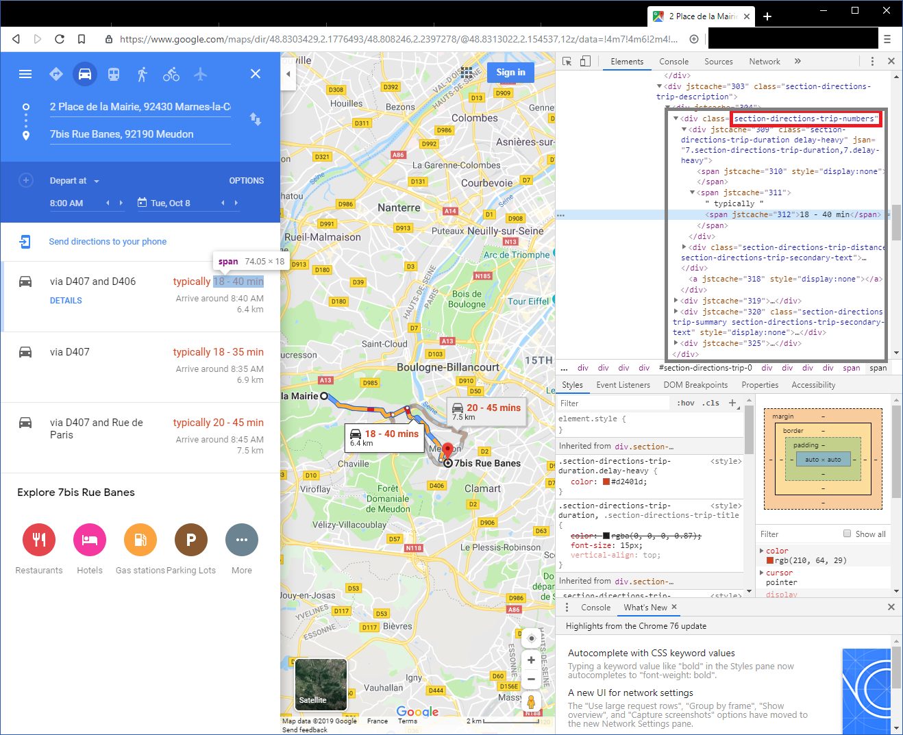
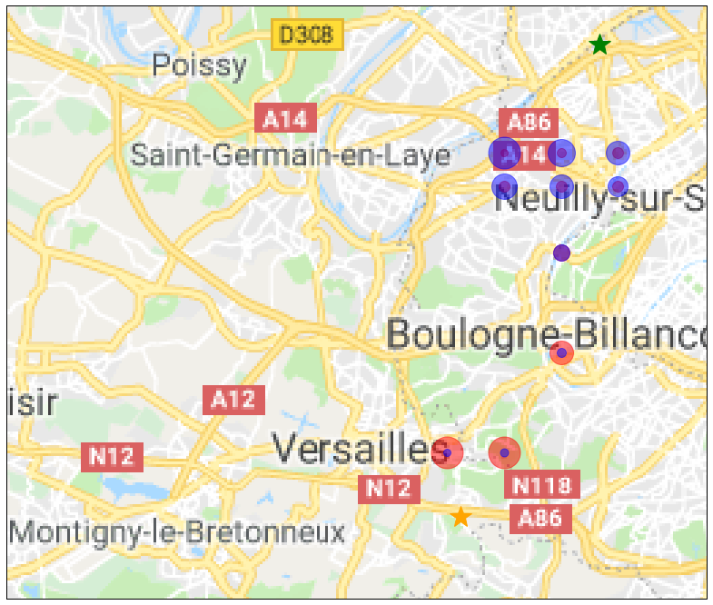

# journeygrid
Get travel time to multiple destinations


## Goal of the project


We will scrap google maps in order to find the travel time from a grid of points to a couple of destinations. This way, we will find the most optimal points to minimize both journeys. This code can be used to pinpoint the best locations to pick a home when two people are working at different locations. By scrapping google maps, we can take into account how the traffic impacts the travel time.


## Scrapping google maps

Since google maps is a dynamic website, we cannot use simple tools such as wget or curl. Even webparsers such as scrappy don't render the DOM hence cannot work in this situation. The easiest way to scrap data from such websites is to take control of a browser by using an automation tool. In this case we will use selenium to take control of Google Chrome with the chromedriver.

You have to install selenium with 

```
conda install -c conda-forge selenium
```

or 

```
pip install selenium
```
you also need to have the ```chromedriver.exe``` downloaded.
BeautifulSoup is a package we will use to parse the html of the webpage opened in chrome. 

In order to extract the estimated travel time, we need to inspect the source code of the page in find the <div> element we are interested in. In our case it is ```section-directions-trip-numbers```. In this ```<div>``` element we will then get the estimated value contained in the ```<span>``` element


    
    
## The code
    
First, let's import selenium, beautiful soup and some other libraries


```python
# Selenium allows to control chrome programmatically
from selenium import webdriver
from selenium.webdriver.common.keys import Keys
from selenium.webdriver.chrome.options import Options

#beautifulsoup is used to parse the dom of the html page
import bs4 as BeautifulSoup

import numpy as np
import pandas as pd
import os
```

We will also need some extra libraries for plotting the results


```python
import matplotlib.pyplot as plt
from matplotlib.transforms import offset_copy

import cartopy.crs as ccrs
import cartopy.io.img_tiles as cimgt

```

Let's define the GPS coordinates of the two destinations we are interested in. The coordinates can be found the the URL of a google maps search


```python
longitudeDestination1 = 48.9361537
latitudeDestination1 = 2.2507129

longitudeDestination2 = 48.7783875
latitudeDestination2 = 2.1803534
```

We will search on an equally spaced grid of point starting from (long_begin, lat_begin) and going to (long_end, lat_end). In order to do so, we will :
 * construct the URL from the GPS coordinates
 * load the url in chrome with ```driver.get```
 * read the resulting html with ```driver.page_source```
 * parse the html with beautiful soup in order to find the first ```<div>``` element with the class ```section-directions-trip-numbers```
 * in this element, we will get the estimated travel time by reading the text value of the second ```<span>``` element


```python
def get_travel_time(url, driver):
    """
    get the estimated travel time of the google maps given as url
    """
    resultats = None
    driver.get(url)

    while resultats == None :
        soupe = BeautifulSoup.BeautifulSoup(driver.page_source, "lxml")
        soupe.select("section-directions-trip-numbers")
        resultats = soupe.find('div',attrs={"class":u"section-directions-trip-numbers"})
    return resultats.find_all("span")[2]

```

Once the function is defined, we only need to call it in a loop in order to get all the point of the grid


```python
os.getcwd()
```


    'C:\\Users\\Guillaume\\Documents\\Code\\website_source\\content\\projects'


```python
chrome_options = Options()
#chrome_options.add_argument("--disable-extensions")
#chrome_options.add_argument("--disable-gpu")
chrome_options.add_argument("--headless") #make chrome headless. If you want to see the autimation, comment this line
driver = webdriver.Chrome(executable_path = '..\\..\\..\\isogrid\\journeygrid\\chromedriver.exe', chrome_options=chrome_options)

nb = 10
ctn = 0
time = []
for coordX in np.linspace(long_begin, long_end, nb):
    for coordY in np.linspace(lat_begin, lat_end, nb):
        
        
        url_journey1 = f"https://www.google.com/maps/dir/{coordX},{coordY}/@{longitudeDestination1},{latitudeDestination1},12z/data=!3m1!4b1!4m14!4m13!1m0!1m5!1m1!1s0x47e67bff078f6575:0x95df2619f9304bd7!2m2!1d2.1825421!2d48.778384!2m4!2b1!6e0!7e2!8j1570521600!3e0"
        url_journey2 = f'https://www.google.com/maps/dir/{coordX},{coordY}/@{longitudeDestination2},{latitudeDestination2},14z/data=!3m1!4b1!4m14!4m13!1m0!1m5!1m1!1s0x47e665df0cb0b919:0x5f513cdf2fe6d39d!2m2!1d2.2572779!2d48.9368666!2m4!2b1!6e0!7e2!8j1570521600!3e0'

        temps_user1 = get_travel_time(url_journey1, driver)
        temps_user2 = get_travel_time(url_journey2, driver)
        
        ctn += 1
        print(f'Downloaded : {ctn/(nb*nb)*100}%')
        time.append([coordX, coordY, temps_user1.text, temps_user2.text, f'https://www.google.com/maps/place/{coordX},{coordY}'])

```

    C:\Users\Guillaume\AppData\Local\Continuum\anaconda3\lib\site-packages\ipykernel_launcher.py:5: DeprecationWarning: use options instead of chrome_options
      """
    

    Downloaded : 1.0%
    Downloaded : 2.0%
    Downloaded : 3.0%
    Downloaded : 4.0%
    [...]
    Downloaded : 96.0%
    Downloaded : 97.0%
    Downloaded : 98.0%
    Downloaded : 99.0%
    Downloaded : 100.0%
    

After gathering the results, the values stored in the ```time``` list are string and cannot be interpreted as numerical values without a post processing. This is why I've written the function ```analyse_time``` in order to split the text and convert it to a numerical format expressed in minutes.


```python
def analyse_time(time):
    """
    Analyse the time given by google maps, splits the lower and higher estimate and converts them to minutes
    """
    tlow = time.split(" - ")[0].replace("\xa0", " ")
    thigh = time.split(" - ")[1].replace("\xa0", " ")

    if ("min" not in tlow) and ("h" not in tlow):
        #example : 26 
        tlow = int(tlow.replace(" ", ""))
    elif "h" not in tlow :
        # example 26 min 
        tlow = tlow.replace("min", "")
        tlow = int(tlow.replace(" ", ""))
    else :
        if "min" in tlow:
            #example 1h 26min
            tlow = tlow.split("h")
            tlow = 60*int(tlow[0].replace(" ", "")) + int(tlow[1].replace("min", "").replace(" ", ""))
        else:
            #example 1h
            tlow = 60*int(tlow.replace("h", ""))
    
    if "h" not in thigh :
        thigh = thigh.replace("min", "")
        thigh = int(thigh.replace(" ", ""))
    else :
        if "min" in thigh:
            thigh = thigh.split("h")
            thigh = 60*int(thigh[0].replace(" ", "")) + int(thigh[1].replace("min", "").replace(" ", ""))
        else:
            thigh = 60*int(thigh.replace("h", ""))

    return (tlow, thigh)
```

For every result previously gathered, let's apply the function ```analyse_time``` then put it in a pandas dataframe. While we are at it, I also computed the geometric mean of the minimum time estimated for both users as well of the maximum time. A geometric mean is interesting in this interesting here because we want to avoid have one user doing a long journey while the other is doing a short one. 


```python
df = []
for t in time:
    lat = t[0]
    lon = t[1]
    t1 = analyse_time(t[2])
    t2 = analyse_time(t[3])
    geomlow = np.sqrt(t1[0]*t2[0]) #geometric mean 
    geomhigh = np.sqrt(t1[1]*t2[1]) #geometric mean 
    df.append([lat, lon, geomlow, geomhigh, t1[0], t1[1], t2[0], t2[1]])


traveltime = pd.DataFrame(df, columns = ["latitude", "longitude", "geometric mean low", "geometric mean high", "time low 1", "time high 1", "time low 2", "time high 2"])
traveltime = traveltime.sort_values("geometric mean low")
traveltime = traveltime.reset_index()
traveltime.to_csv("extraction.csv", index=False) #save it to csv
traveltime.head(10) #print the 10 first rows
```

    


<div>
<style scoped>
    .dataframe tbody tr th:only-of-type {
        vertical-align: middle;
    }

    .dataframe tbody tr th {
        vertical-align: top;
    }

    .dataframe thead th {
        text-align: right;
    }
</style>
<table border="1" class="dataframe">
  <thead>
    <tr style="text-align: right;">
      <th></th>
      <th>index</th>
      <th>latitude</th>
      <th>longitude</th>
      <th>geometric mean low</th>
      <th>geometric mean high</th>
      <th>time low 1</th>
      <th>time high 1</th>
      <th>time low 2</th>
      <th>time high 2</th>
    </tr>
  </thead>
  <tbody>
    <tr>
      <th>0</th>
      <td>38</td>
      <td>48.833333</td>
      <td>2.231111</td>
      <td>16.124515</td>
      <td>33.166248</td>
      <td>10</td>
      <td>20</td>
      <td>26</td>
      <td>55</td>
    </tr>
    <tr>
      <th>1</th>
      <td>89</td>
      <td>48.888889</td>
      <td>2.260000</td>
      <td>16.248077</td>
      <td>36.742346</td>
      <td>22</td>
      <td>45</td>
      <td>12</td>
      <td>30</td>
    </tr>
    <tr>
      <th>2</th>
      <td>97</td>
      <td>48.900000</td>
      <td>2.202222</td>
      <td>16.733201</td>
      <td>40.987803</td>
      <td>35</td>
      <td>70</td>
      <td>8</td>
      <td>24</td>
    </tr>
    <tr>
      <th>3</th>
      <td>6</td>
      <td>48.800000</td>
      <td>2.173333</td>
      <td>16.733201</td>
      <td>35.777088</td>
      <td>8</td>
      <td>16</td>
      <td>35</td>
      <td>80</td>
    </tr>
    <tr>
      <th>4</th>
      <td>98</td>
      <td>48.900000</td>
      <td>2.231111</td>
      <td>17.320508</td>
      <td>41.109610</td>
      <td>30</td>
      <td>65</td>
      <td>10</td>
      <td>26</td>
    </tr>
    <tr>
      <th>5</th>
      <td>99</td>
      <td>48.900000</td>
      <td>2.260000</td>
      <td>17.663522</td>
      <td>37.815341</td>
      <td>26</td>
      <td>55</td>
      <td>12</td>
      <td>26</td>
    </tr>
    <tr>
      <th>6</th>
      <td>88</td>
      <td>48.888889</td>
      <td>2.231111</td>
      <td>17.663522</td>
      <td>40.620192</td>
      <td>26</td>
      <td>55</td>
      <td>12</td>
      <td>30</td>
    </tr>
    <tr>
      <th>7</th>
      <td>7</td>
      <td>48.800000</td>
      <td>2.202222</td>
      <td>17.748239</td>
      <td>34.641016</td>
      <td>9</td>
      <td>16</td>
      <td>35</td>
      <td>75</td>
    </tr>
    <tr>
      <th>8</th>
      <td>68</td>
      <td>48.866667</td>
      <td>2.231111</td>
      <td>18.000000</td>
      <td>37.416574</td>
      <td>18</td>
      <td>35</td>
      <td>18</td>
      <td>40</td>
    </tr>
    <tr>
      <th>9</th>
      <td>87</td>
      <td>48.888889</td>
      <td>2.202222</td>
      <td>18.330303</td>
      <td>43.874822</td>
      <td>28</td>
      <td>55</td>
      <td>12</td>
      <td>35</td>
    </tr>
  </tbody>
</table>
</div>


Ok now that we finished preparing the data, it's time to draw some maps.
We will use caropy in order to download some Google maps tiles. You might need to manually change the extent of the map.


```python
%matplotlib inline
plt.rcParams['figure.figsize'] = 20, 12
# Create a Stamen terrain background instance.
stamen_terrain = cimgt.GoogleTiles()
fig = plt.figure()
# Create a GeoAxes in the tile's projection.
ax = fig.add_subplot(1, 1, 1, projection=stamen_terrain.crs)

# Limit the extent of the map to a small longitude/latitude range.
ax.set_extent([lat_begin*0.975, lat_end*1.02, long_begin*0.999, long_end*1.001], crs=ccrs.Geodetic())


# Add the Stamen data at zoom level 10.
ax.add_image(stamen_terrain, 10)
```

Now, we draw the 10 points that minimize time for user 1, color them is red and make the size of the pot proportionnal to the travel time of the second user. 
And we do the same for he 10 points that minimize time for user 2, color them is blue and make the size of the pot proportionnal to the travel time of the first user. 


```python
for i, point in traveltime.sort_values("time low 1").iterrows():
    if i < 10 :
        ax.plot( point.longitude, point.latitude, marker='o', 
            c ='red', markersize=point["time low 2"],
            alpha=0.5, transform=ccrs.Geodetic())

for i, point in traveltime.sort_values("time low 2").iterrows():
    if i < 10 :
        ax.plot( point.longitude, point.latitude, marker='o', 
            c ='blue', markersize=point["time low 1"],
            alpha=0.5, transform=ccrs.Geodetic())
        
```

To help with the vizualisation, we add two stars on the maps in order to mark the location of the 2 destinations.


```python
    
# Add a marker for destination 1
ax.plot( latitudeDestination1, longitudeDestination1, marker='*', 
            c ='green', markersize=25,
            alpha=1, transform=ccrs.Geodetic())
# Add a marker for destination 2
ax.plot( latitudeDestination2, longitudeDestination2, marker='*', 
            c ='orange', markersize=25,
            alpha=1, transform=ccrs.Geodetic())        

geodetic_transform = ccrs.Geodetic()._as_mpl_transform(ax)
text_transform = offset_copy(geodetic_transform, units='dots', x=-25)

```

Finally, we draw the maps. The optimal point is where both the dots in blue and in red are smaller.


```python
plt.show()
```




